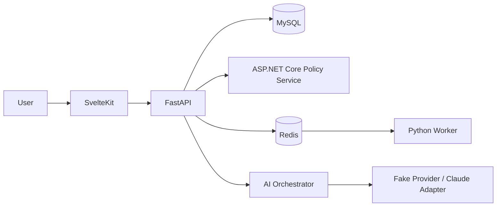

# 03. Architecture Overview

Use a FastAPI modular monolith, focused ASP.NET Core policy service, SvelteKit client, MySQL database, Redis queue, Python worker, and Claude-compatible provider abstraction.

SvelteKit owns authenticated UI workflows. FastAPI owns business workflows and persistence coordination. ASP.NET Core evaluates versioned deterministic policies without direct database access. The worker handles asynchronous jobs. The orchestrator retrieves allowlisted evidence, validates structured responses and citations, and requires human approval.

Security uses standards-based identity seams, role/scope checks, restrictive CORS, CSRF protection where cookies are used, secret injection, validation, redacted logs, rate controls, and synthetic data only.

Observability propagates correlation IDs and captures logs, metrics, traces, health/readiness, job outcomes, model latency, token usage, and tool outcomes.
