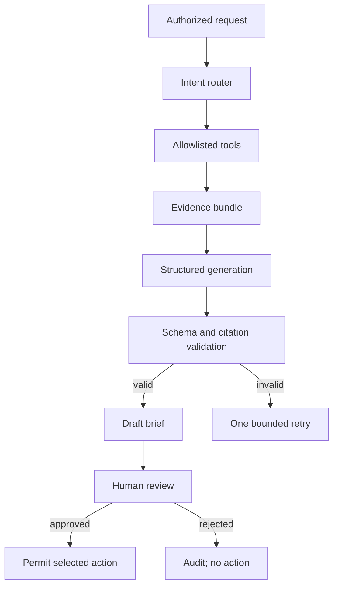

# 08. Agent Design

Deterministic services establish facts and findings. AI assembles context, explains evidence, and drafts recommendations.

Allowed intents: summarize readiness, explain finding, compare assessments, identify missing evidence, and propose review questions.

Tools retrieve application profile, assessment, findings, dependencies, evidence metadata, owners, and comparison data. Tools are authorization checked, schema validated, bounded, and return source IDs.

Use Claude and fake provider adapters behind one interface. Reject unknown citations. Treat tool output as untrusted. Redact secrets and personal data. Do not expose hidden reasoning. Require approval for side effects.
